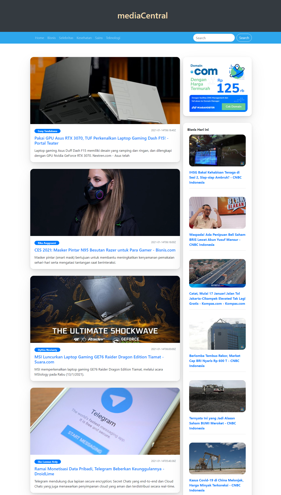

# mediaCentral
mediaCentral adalah media yang menggabungkan berbagai berita indonesia dari berbagai sumber media berita.

###How to use
- Clone master branch
- npm install
- change apikey in services/configs/config.js
- npm start

###What inside this project
- axios
- react-icons
- react-router
- bootstrap
- sweet alert

###Live Demo
- https://mediacentral.web.app/
`coz api retriction in production build, this project only can be run in localhost`

####still confused with this project structure, any help will be appreciated

